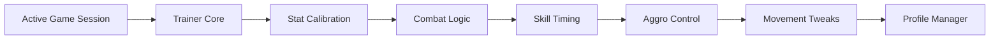

## Overview

The Quinfall Trainer is a standalone control utility that connects to active **The Quinfall** sessions and provides access to internal gameplay systems through a structured trainer interface. Instead of relying on static presets, the trainer exposes adjustable logic layers covering character statistics, combat resolution, skill execution rules, and world interaction checks. Typical trainer usage includes stat recalibration, cooldown behavior tuning, damage logic reshaping, and controlled interaction overrides. The system is built around isolated feature scopes, predictable value application, and session-stable behavior without modifying original assets.

---

## Character Stat Calibration 🧬

* Live adjustment of health, stamina, and mana
* Scaling for primary and secondary attributes
* Temporary boost or fixed-value modes

**In-game behavior:**
Rebalances active character parameters during exploration or combat while keeping non-player entities unaffected.

---

## Combat Logic Controller ⚔️

* Outgoing damage multiplier tuning
* Incoming damage dampening
* Hit and crit evaluation influence

**Feature intent:**
Restructures how combat outcomes are calculated, allowing controlled survivability and damage output adjustments.

---

## Skill Execution & Cooldown Handling ⏱️

* Cooldown reduction or suspension
* Ability reuse validation control
* Skill-specific scope selection

**In-game behavior:**
Modifies internal timing and charge checks that govern how frequently abilities can be executed during encounters.

---

## Resource Flow Adjustment 📦

* Currency value modification
* Crafting and material counter control
* Lock, normalize, or incremental behavior

**Feature intent:**
Manages progression-related values while maintaining consistency across inventory and crafting subsystems.

---

## Movement & Physics Tweaks 🧭

* Movement speed scaling
* Collision and interaction flag overrides
* Context-aware activation rules

**In-game behavior:**
Alters how the character navigates terrain and interacts with world objects without destabilizing physics logic.

---

## Enemy Awareness & Aggro Logic 👁️

* Detection radius reshaping
* Aggro trigger condition tuning
* Awareness state management

**Feature intent:**
Controls how hostile entities evaluate proximity and engagement conditions during roaming and combat phases.

---

## Trainer Profile Manager 💾

* Multiple configurable profiles
* Manual or automatic profile loading
* Version-aware configuration storage

**In-game behavior:**
Preserves trainer states between sessions, ensuring consistent setup without repeated configuration.

---

---

## FAQ

**Are trainer changes applied immediately?**
Yes, supported parameters update as soon as values are modified.

**Can adjustments be limited to the player character?**
Most systems are scoped to player-controlled entities only.

**Do configured values persist after restarting the game?**
Only saved trainer profiles persist between sessions.

**Is enemy aggression fully disabled?**
Aggro behavior can be reduced or reshaped, not forcibly removed.

**Are combat modifiers applied globally?**
Damage and mitigation logic can be scoped per feature.

**Does the trainer alter original game files?**
No, all changes occur through live-session control only.

---

## Feature Summary

* Character stat recalibration
* Combat calculation control
* Skill timing and cooldown handling
* Resource and progression value adjustment
* Movement and interaction tweaks
* Enemy awareness and aggro tuning
* Persistent trainer profiles

---
